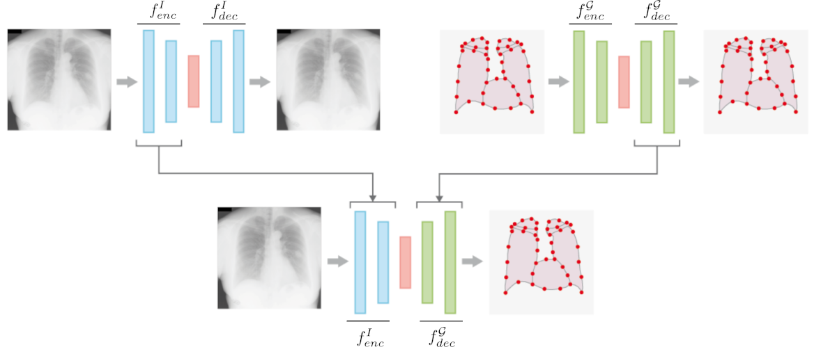

# HybridGNet: Hybrid graph convolutional neural networks for landmark-based anatomical segmentation

Nicolás Gaggion¹, Lucas Mansilla¹, Diego Milone¹, Enzo Ferrante¹

¹ Research Institute for Signals, Systems and Computational Intelligence (sinc(i)), FICH-UNL, CONICET, Ciudad Universitaria UNL, Santa Fe, Argentina.

Full-paper accepted at MICCAI 2021. \
Pre-print available at https://arxiv.org/abs/2106.09832



### Installation:

First create the anaconda environment:
```
conda env create -f env.yml
```
Activate it with:
```
conda activate torch
```

In case the installation fails, you can build your own enviroment.

Dependencies: \
-PyTorch 1.8.1 \
-Torchvision \
-PyTorch Geometric 1.7.0 (https://pytorch-geometric.readthedocs.io/en/latest/notes/installation.html) \
-Mesh library from https://github.com/MPI-IS/mesh \
-OpenCV 4.5.1 \
-NumPy \
-Scikit-learn \
-Scikit-image \
-Pandas  \
-Scipy \
-Medpy

### Dataset:

Register at the Japanese Society of Radiological Technology website (http://db.jsrt.or.jp/eng.php) and download the .zip file containing all 247 images. Unzip the images on the Dataset/All247images folder and then run the Preprocess.ipynb Jupyter notebook for pre-processing.

### Paper reproducibility:

Three Jupyter notebooks are provided reproducing the 3 presented experiments.

For more information about the MultiAtlas baseline, check Lucas Mansilla's repository:
https://github.com/lucasmansilla/Multi-Atlas_RCA
