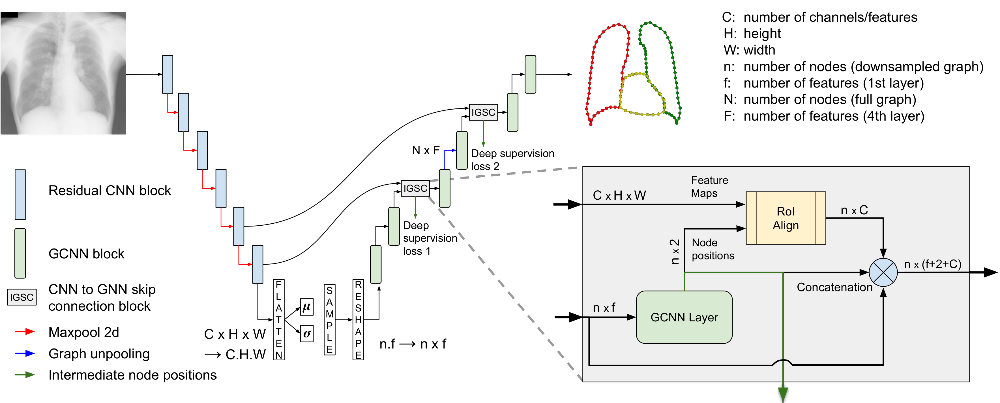

# HybridGNet - Improving anatomical plausibility in image segmentation via hybrid graph neural networks: applications to chest x-ray image analysis

Nicolás Gaggion¹, Lucas Mansilla¹, Candelaria Mosquera²³, Diego Milone¹, Enzo Ferrante¹

¹ Research Institute for Signals, Systems and Computational Intelligence (sinc(i)), FICH-UNL, CONICET, Ciudad Universitaria UNL, Santa Fe, Argentina.
² Hospital Italiano de Buenos Aires, Buenos Aires, Argentina
³ Universidad Tecnológica Nacional, Buenos Aires, Argentina



### 2022 Journal Version

IEEE TMI: https://doi.org/10.1109%2Ftmi.2022.3224660

Arxiv: https://arxiv.org/abs/2203.10977

Citation: 

```
@article{Gaggion_2022,
	doi = {10.1109/tmi.2022.3224660},
	url = {https://doi.org/10.1109%2Ftmi.2022.3224660},
	year = 2022,
	publisher = {Institute of Electrical and Electronics Engineers ({IEEE})},
	author = {Nicolas Gaggion and Lucas Mansilla and Candelaria Mosquera and Diego H. Milone and Enzo Ferrante},
	title = {Improving anatomical plausibility in medical image segmentation via hybrid graph neural networks: applications to chest x-ray analysis},
	journal = {{IEEE} Transactions on Medical Imaging}
}
```

### MICCAI 2021 Paper

For the old version of the code, check on Tags

Paper: https://link.springer.com/chapter/10.1007%2F978-3-030-87193-2_57

## Installation:

First create the anaconda environment:

```
conda env create -f environment.yml
```
Activate it with:
```
conda activate torch
```

In case the installation fails, you can build your own enviroment.

Conda dependencies: \
-PyTorch 1.10.0 \
-Torchvision \
-PyTorch Geometric \
-Scipy \
-Numpy \
-Pandas  \
-Scikit-learn \
-Scikit-image 

Pip dependencies: \
-medpy==0.4.0 \
-opencv-python==4.5.4.60 

## Datasets:

Download the datasets from the official sources (check Datasets/readme.txt) and run the corresponding preprocessing scripts.

A new dataset of landmark annotations was released jointly with this work. Available at https://github.com/ngaggion/Chest-xray-landmark-dataset

## Paper reproducibility:

Download the weights from here: https://drive.google.com/drive/folders/1YcmT8JzdtNuaWVqhv8Zfm00lF47w0eU5

For more information about the MultiAtlas baseline, check Lucas Mansilla's repository:
https://github.com/lucasmansilla/multiatlas-landmark
